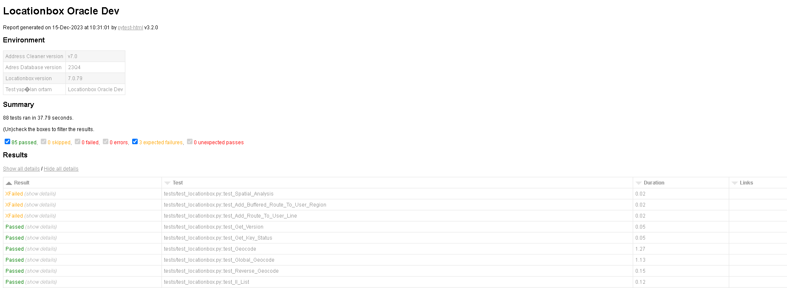

## Pytest ile Locationbox API Test Otomasyonu

- Locationbox konum bazlı uygulamalar için kullanılan bir API'dır.
- https://www.locationbox.com.tr adresini ziyaret ederek Locationbox hakkında bilgi alabilirsiniz.
- Bu test otomasyon çalışmasında Locationbox'ın sahip olduğu bütün servisler için test fonksiyonları bulunmaktadır.
    * Her servis için hem JSON Response hem XML response kontrol edilir.
    * Database kullanan servisler için istek sonrası DB kontrolleri de yapılır.
    * 4 farklı environment için testler yazılmıştır.
    * Repoyu indirdikten sonra .env copy dosyasının ismini .env olarak değiştirin.
    * .env dosyasındaki gerekli parametlerini doldurun.
    * Aşağıdaki komut ile testleri başlatabilirsiniz.

    ```pytest --html=report.html --self-contained-html --capture=tee-sys -p no:warnings``` 
- Test sonrasında servisler için success/fail, request url, response, duration vb. sonuçlar üreten bir çıktı ( report.html ) oluşmaktadır.

